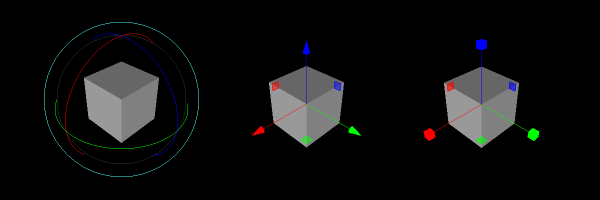

This fork comes from Cedric Guillemet's project https://github.com/CedricGuillemet/LibGizmo.



# Build

From the root folder, type the following in a terminal:

`$ mkdir build && cd build`

`$ cmake ..`

`$ make`

# Run the app

Once compile, simply run

`$ ./app/example`

# Modifications from original branch

- restructure file/folder of the project
- cmake compilation
- port to glew + glfw (submodules)
- port to OpenGL 3.3 core profile (glBegin -> shader)
- gizmo improvement (Maya style)

# To do

- port to Linux
- restructure to avoid multi extends
- replace static GizmoTransformRender by Singleton
- remove scale from local gizmo
- ignore mouse if hover hidden part of rotation circles
- replace custom mat lib (Z....h/.cpp/.inl) by glm
- clean the app example


# INTRODUCTION
 
 - LibGizmo is a small, standalone library that adds a 3D matrix (4x4 floats) manipulation control 
   called 'Gizmo'. It consists of 3 different controls: a Move, a Rotate and a Scale. It works the 
   same way as in 3DStudio Max or Maya. It's written using C++ and the current implementation use 
   OpenGL fixed pipeline. Integration should be easy.


# LICENSE

Copyright (C) 2012 Cedric Guillemet

Permission is hereby granted, free of charge, to any person obtaining a copy of
this software and associated documentation files (the "Software"), to deal in
the Software without restriction, including without limitation the rights to
use, copy, modify, merge, publish, distribute, sublicense, and/or sell copies
of the Software, and to permit persons to whom the Software is furnished to do
so, subject to the following conditions:

The above copyright notice and this permission notice shall be included in all
copies or substantial portions of the Software.

THE SOFTWARE IS PROVIDED "AS IS", WITHOUT WARRANTY OF ANY KIND, EXPRESS OR
IMPLIED, INCLUDING BUT NOT LIMITED TO THE WARRANTIES OF MERCHANTABILITY,
FITNESS FOR A PARTICULAR PURPOSE AND NONINFRINGEMENT. IN NO EVENT SHALL THE
AUTHORS OR COPYRIGHT HOLDERS BE LIABLE FOR ANY CLAIM, DAMAGES OR OTHER
LIABILITY, WHETHER IN AN ACTION OF CONTRACT, TORT OR OTHERWISE, ARISING FROM,
OUT OF OR IN CONNECTION WITH THE SOFTWARE OR THE USE OR OTHER DEALINGS IN THE
SOFTWARE.


# Contact

 - email/GTALK : cedric.guillemet@gmail.com
 - Twitter : @skaven_
 - web : http://www.skaven.fr
 

# USE

 - Set include path to inc, library path to lib

 - Link with LibGizmoDebug.lib for debug build, LibGizmo.lib for release

 - In your code :
```cpp
	#include "iGizmo.h"
```

 - create one or more Gizmo with the functions : CreateMoveGizmo(), CreateRotateGizmo(), CreateScaleGizmo()

 - set a pointer to the 16 floats composing the matrix you want to edit
```cpp
	gizmo->SetEditMatrix( objectMatrix );
```
 - Any time the display viewport changes, call SetScreenDimensions
  ```cpp
    	gizmo->SetScreenDimension( screenWidth, screenHeight );
```
 - Once a frame, call SetCameraMatrix. The matrices you send
```cpp
	float viewMat[16];
	float projMat[16];
       
	glGetFloatv (GL_MODELVIEW_MATRIX, viewMat );  
	glGetFloatv (GL_PROJECTION_MATRIX, projMat );  

	gizmo->SetCameraMatrix( viewMat, projMat );
```

 - Draw the gizmo
  ```cpp
        gizmo->Draw();
```
 - Change the kind of matrix manipulation (view, local, world). Example for 'WORLD' mode:
```cpp
	gizmo->SetLocation( IGizmo::LOCATE_WORLD );
```
 - When you receive a mouse button down, call
```cpp
   if (gizmo->OnMouseDown( mousex, mousey ))
        SetCapture( hWnd );
```
This methods returns true if you have to capture the mouse. mousex and mousey are display viewport
	local coordinates. 0,0 is upper left.
 - for mouse move and mouse button up, call:
```cpp
		gizmo->OnMouseMove( mousex, mousey );
        gizmo->OnMouseUp( mousex, mousey );
```

# RENDERING

 - The rendering code is done by OpenGL Fixed pipeline. The implementation is done in GizmoTransformRender.cpp.
   6 methodes are called by all the 3 gizmo:

void DrawCircle(const tvector3 &orig,float r,float g,float b,const tvector3 &vtx,const tvector3 &vty);
void DrawCircleHalf(const tvector3 &orig,float r,float g,float b,const tvector3 &vtx,const tvector3 &vty,tplane &camPlan);
void DrawAxis(const tvector3 &orig, const tvector3 &axis, const tvector3 &vtx,const tvector3 &vty, float fct,float fct2,const tvector4 &col);
void DrawCamem(const tvector3& orig,const tvector3& vtx,const tvector3& vty,float ng);
void DrawQuad(const tvector3& orig, float size, bool bSelected, const tvector3& axisU, const tvector3 &axisV);
void DrawTri(const tvector3& orig, float size, bool bSelected, const tvector3& axisU, const tvector3& axisV);

   You can implement those methods using any API. There aren't any other call to a rendering library anywhere
   else. There is an old (untested) version using DX9 api.

# TODO

 - Linux/MacOSX port
 - Code cleanup
 - improve example with local/world/screen space change
 - DX10/11 rendering


